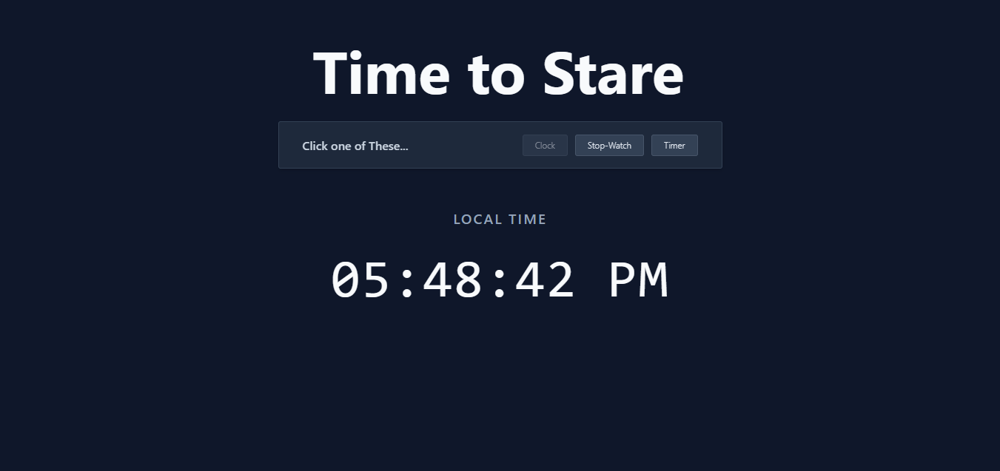
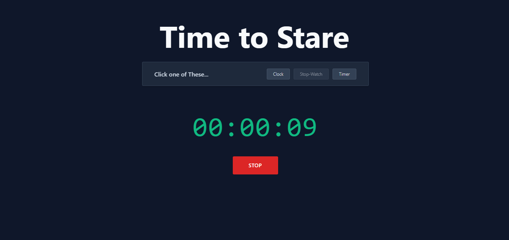
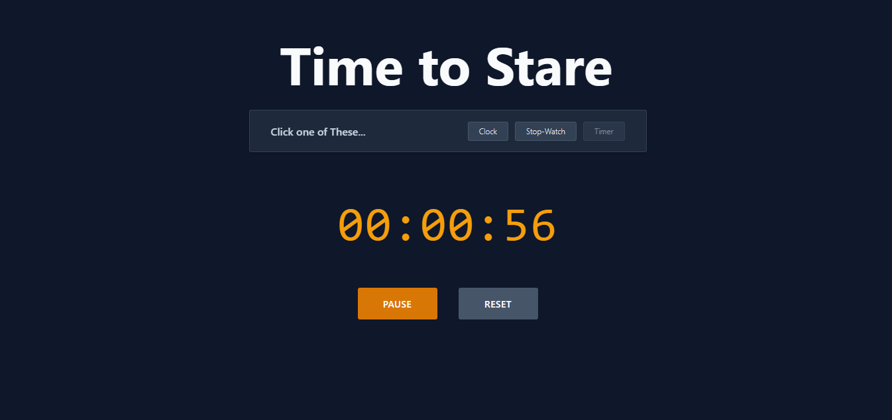

# Clock + Stopwatch + Timer (JavaScript)

A simple **multi-functional time utility** built with HTML, CSS, and JavaScript.  
Switch between **Clock**, **Stopwatch**, and **Countdown Timer**.

## 📷 Screenshots

### 🕒 Clock

### ⏱ Stopwatch

### ⏳ Timer

## Features

### Clock
- Displays **current time** in 12-hour format with AM/PM.

### Stopwatch
- Start, stop, resume, and reset functionality.
- Tracks **hours, minutes, and seconds**.

### Timer
- User inputs minutes, starts countdown.
- Pause, restart, and reset options.
- Alerts when time is up.

## Developer’s Journey

I built this project to **practice DOM manipulation and event handling** in Vanilla JavaScript while managing multiple independent features in one app.

Key learning points:
- Dynamically **show/hide UI sections** using class toggles.
- Handling **multiple independent timers** (`setInterval` / `clearInterval`) without conflicts.
- Formatting time values with **`padStart()`** for consistent display.
- Structuring code so that **each feature works independently** but still shares the same UI.

### Challenges I faced:
- Ensuring **mode switching** didn’t leave hidden timers running in the background.
- Keeping **UI states synced** with the timer/stopwatch logic.
- Managing **pause/resume logic** without resetting time values.

This project gave me strong practice in **JavaScript state management** and building **multi-tool interfaces** without frameworks.